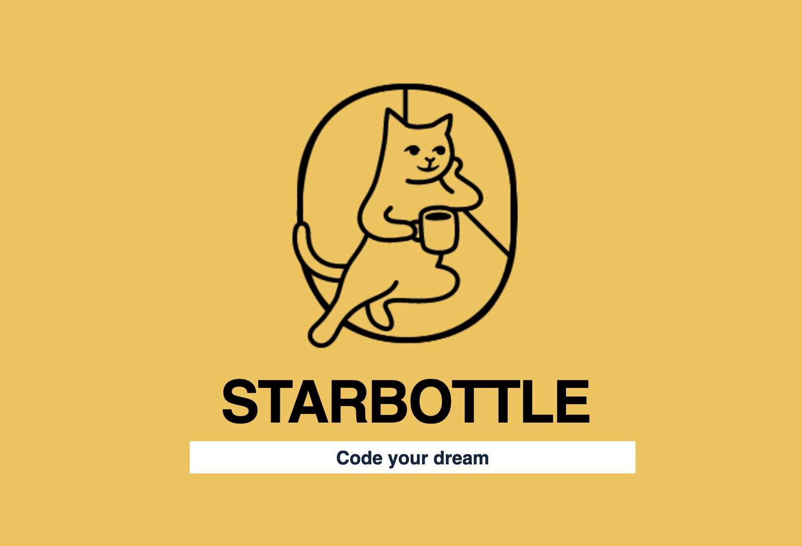
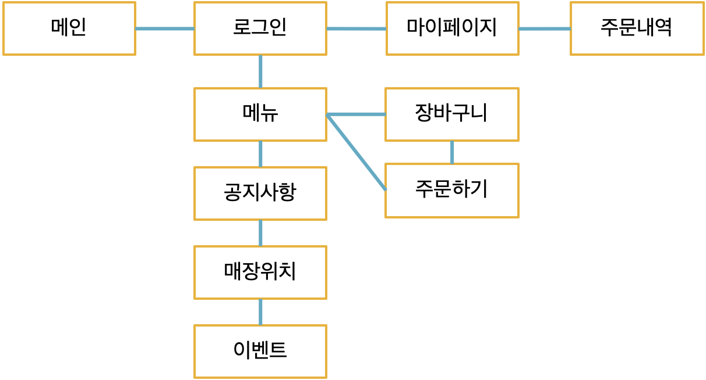
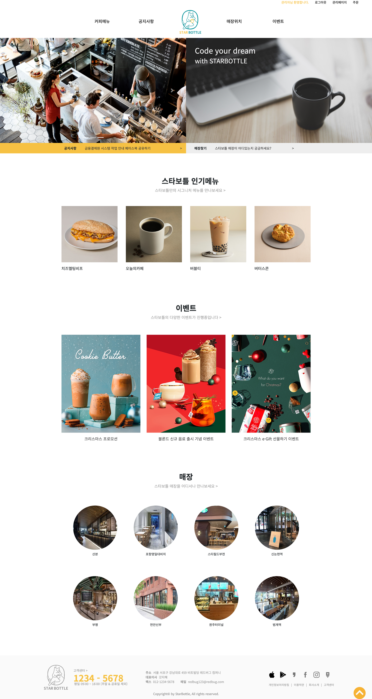
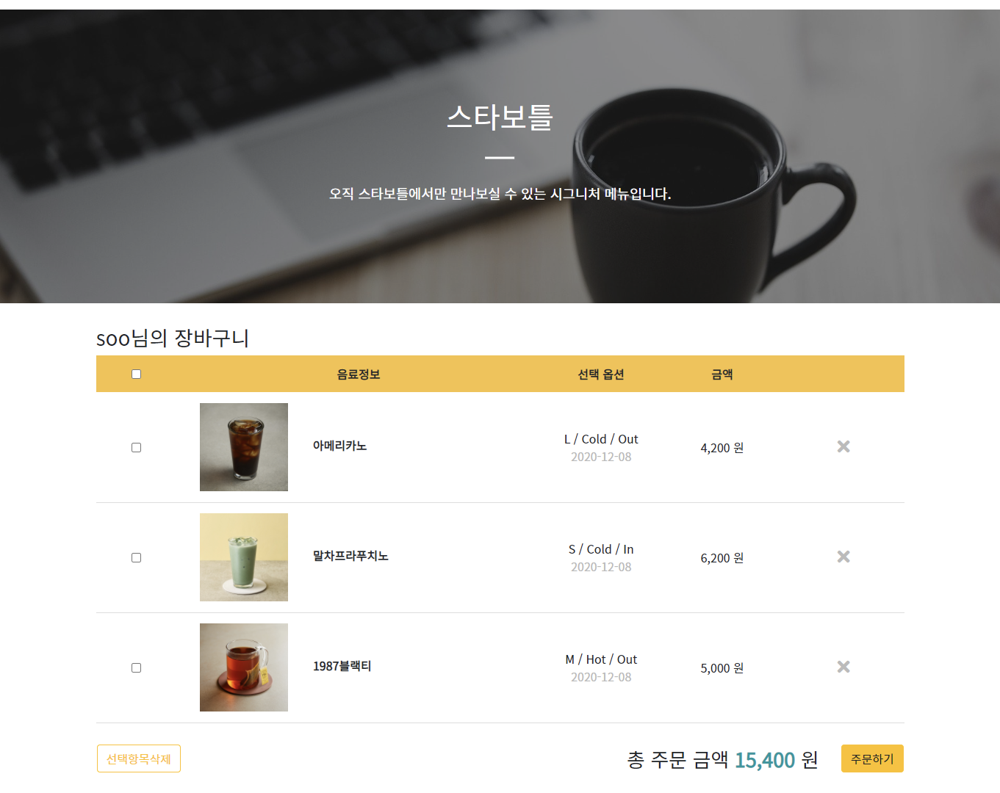
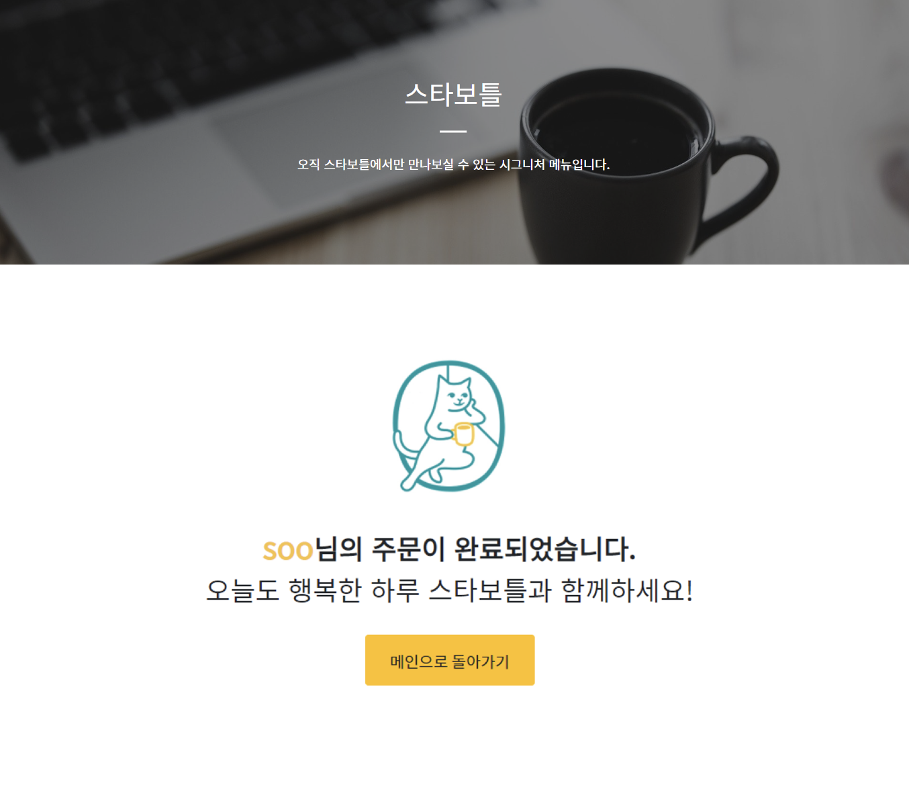
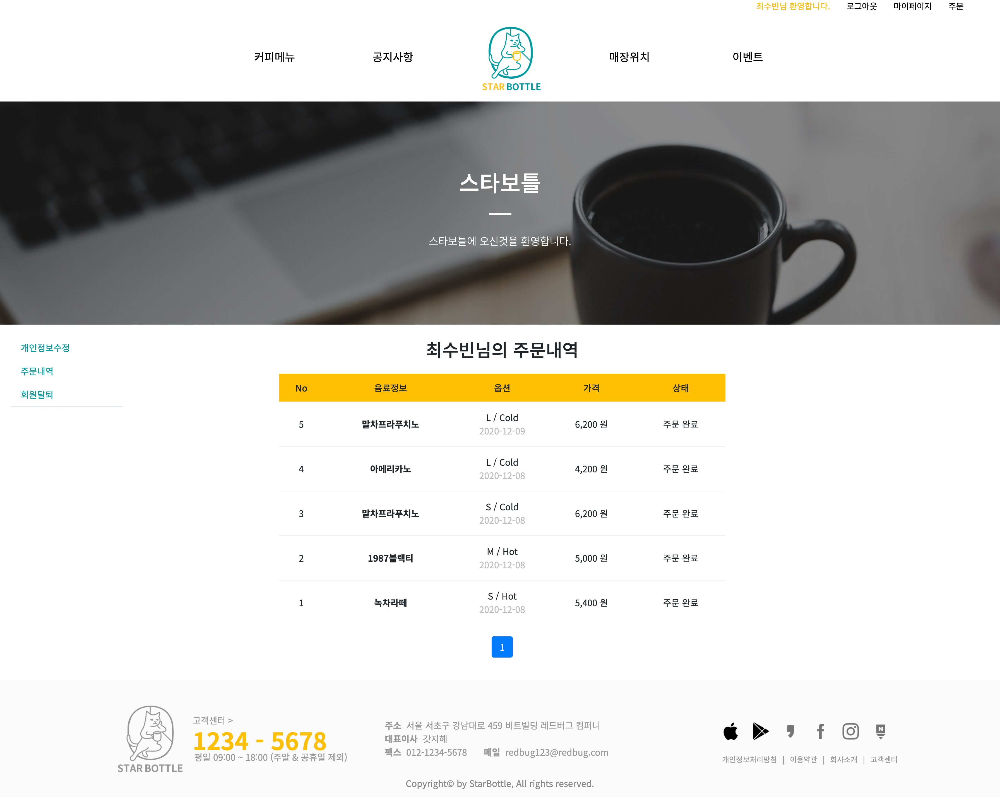

# StarBottle

Created: 2020년 11월 25일 → 2020년 12월 9일
Type: CSS, DB, HTML, JAVA, JSP, MySQL
속성: https://github.com/minjeong13/minjeong13.git

## Read me ──

카페 멤버십 사이트 구현.
각 페이지에서 동일하게 보여지는 상단 헤더부분과, 네비게이션, 풋터의 레이아웃을 잡고, 가운데 컨텐츠 부분만 바뀔 수 있도록 JSP의 include방식을 사용하였습니다.
메인 페이지에서 카페의 인기메뉴가 좌,우 자동 스크롤링이 되어 보여지고, 그 아래로 최신 이벤트 3가지가 차례대로 보여지도록 구현하였습니다. 제일 마지막에는 매장 8곳이 랜덤으로 보여지도록 구현하였습니다.
네비게이션에서 '메뉴'를 클릭하면 카페에서 판매중인 메뉴들을 카드형식으로 확인 할 수 있고, 메뉴를 클릭하면 
해당 메뉴의 상세페이지로 이동하게 됩니다. 이 상세페이지에서 '주문하기' 버튼을 누르면 해당 메뉴의 옵션을 선택하는 페이지로 이동하게 되고, 옵션을 모두 선택하면 장바구니창이 나타나게 됩니다. 
장바구니창에서 자신이 주문하지 않을 메뉴를 선택하여 삭제가 가능하고, 주문할 메뉴를 선택하여 주문하기 버튼을 누르면 주문 완료 페이지로 이동하게 되며 장바구니창에서 해당 메뉴들이 삭제가 됩니다.
그리고 마이페이지의 주문 내역에서 본인이 주문한 메뉴들의 내역을 확인할 수 있도록 하였습니다.

저는 다양한 기능 중 메뉴 상세페이지에서 메뉴를 눌렀을 때 나오는 메뉴 주문하기 페이지와 장바구니 페이지, 주문 완료 페이지, 마이페이지의 주문 내역페이지를 구현하였습니다.
또한 모든 개발 완료 후 전체적인 페이지 검수 및 디자인을 수정하였습니다.

### Git File >

SemiPj > WebContent >

- layout : 웹 페이지의 가장 큰 레이아웃을 결정하는 네비게이션, 메인, 메뉴 개발
- login : 웹 페이지 로그인 개발
- menu : 스타보틀 카페의 메뉴를 소개하는 페이지 개발
- menusave : 사이트 관리자가 카페 메뉴를 관리하는 페이지 개발
- mypage : 사이트 이용자들이 정보수정 및 주문 내역을 확인하는 마이페이지 개발
- order : 카페 메뉴 주문 페이지 및 장바구니, 주문 완료 페이지 개발
- map : 스타보틀 카페의 위치를 확인 할 수 있는 페이지 개발 (카카오 맵 API 사용)
- event : 카페에서 주최하는 이벤트를 확인할 수 있는 페이지 개발
- gonji : 카페 공지사항 페이지 개발 (스마트 에디터 사용)
- member : 사이트 회원가입 페이지 개발

## Site Map ──

## Outputs ──

### Main

### Menu Order

### Cart

### Order Success

### Order Check

